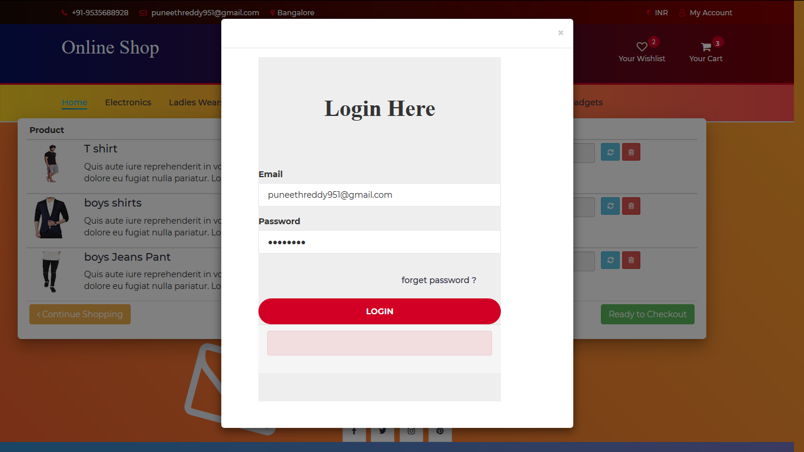
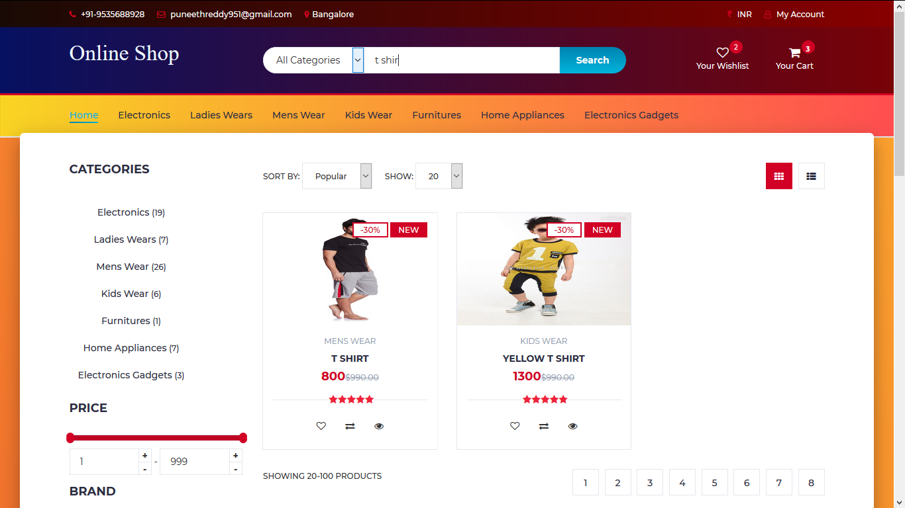
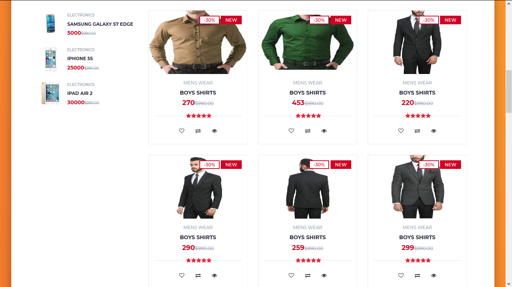

> ## Updated project with extra Features like WISHLIST, List Orders, add Reviews, updated routing, resolved search bug is available for Premium 

# Installation

1. Install XAMPP or WAMPP.

2. Open XAMPP Control panal and start [apache] and [mysql] .

3. Download project from github
    
4. extract files in C:\\xampp\htdocs\.

5. open link localhost/phpmyadmin

6. click on new at side navbar.

7. give a database name as (onlineshop) hit on create button.

8. after creating database name click on import.

9. browse the file in directory[PHP-Online-Shopping-System/database/onlineshop.sql].

10. after importing successfully.

11. open any browser and type http://localhost/online-shopping-system-with-advanced-admin-page-master.

12. first register and then login

13. admin login details  Email=admin@gmail.com or username = admin and Password=123456789.

## If you like my project 
Bye me Cup of coffee

# Screenshots

## Contributing
Pull requests are welcome. For major changes, please open an issue first to discuss what you would like to change.

Please make sure to update tests as appropriate.
